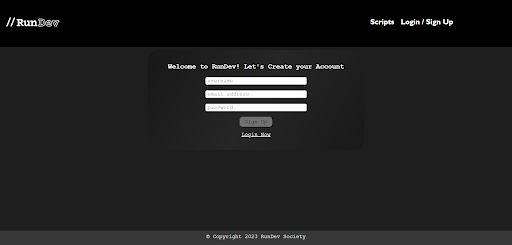
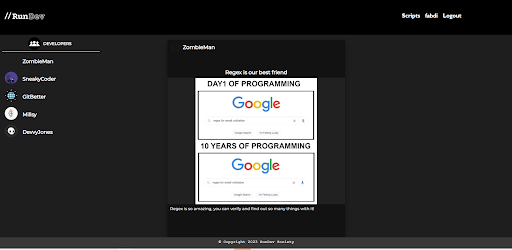
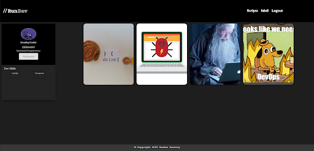

# //RunDev

[RunDev Website](https://rundev-625acb8fef45.herokuapp.com/)

## Table of Contents

- [Description](#description)
- [Usage](#usage)
- [Features](#features)
- [Compatibility](#compatibility)
- [Technologies Used](#technologies-used)
- [Installation](#installation)
- [Screenshots](#screenshots)

## Description

//RunDev is the ultimate social media platform for developers to share images, network with peers, and personalize their profiles. Whether you're a seasoned developer or just starting your journey, //RunDev has something for everyone.

## Usage

- **Account Registration:** Upon launching the app, you can sign up for an account using your email and password. Fill in your registration details, including your email and a secure password. After successful registration, you can proceed to login.

- **Login:** Enter your registered email and password. Click the "Login" button to access your //RunDev account.

## Features

- **Interacting with Posts:** You can like and comment on posts created by other developers. By clicking the heart icon, you can "Like" a post. To leave a comment, click on the comment icon and type your thoughts.

- **Profile Management:** Explore other developers' profiles by clicking on their usernames. On your own profile, you can view your posts and followers. You can also follow other developers to keep up with their updates.

- **Settings:** Access the "Settings" page from the app's navigation menu. Here, you can update your:
  - Username
  - Profile Picture
  - Location
  - Jobs
  - Hobbies
  - Developer Skills

## Compatibility

//RunDev is designed to be responsive and accessible on any device, be it a desktop computer, tablet, or smartphone. You can enjoy a seamless experience regardless of your preferred device.

## Technologies Used

- **AWS (Amazon Web Services):** AWS provides a robust and scalable infrastructure for hosting the //RunDev app and managing data storage, ensuring high availability and reliability.

- **Material UI:** Material UI is used for designing the app's user interface, offering a clean and visually appealing design with a focus on user experience.

- **React:** //RunDev's frontend is built using React, a popular JavaScript library for building interactive and dynamic user interfaces.

- **Node.js:** The backend of //RunDev is powered by Node.js, which allows for efficient server-side scripting and handling of HTTP requests.

- **Express:** Express.js is used as the web application framework for Node.js, simplifying routing, middleware management, and API development.

- **GraphQL:** GraphQL is employed to efficiently query and manipulate data, providing a flexible and optimized way to interact with the server.

- **Apollo Server Express:** Apollo Server Express is used to set up the GraphQL server, facilitating data retrieval and mutation operations efficiently.

- **Bcrypt:** Bcrypt is utilized for securely hashing and storing user passwords, ensuring that user data remains protected.

- **JSON Web Tokens (JWT):** JWTs are employed for user authentication and authorization, enhancing the security of //RunDev.

- **Mongoose:** Mongoose is a MongoDB object modeling tool used to interact with the MongoDB database, making it easier to work with data models and queries. These technologies have been carefully selected to provide a powerful, secure, and user-friendly experience for developers using //RunDev. The combination of AWS for infrastructure, Material UI for design, React for the frontend, and a robust backend stack ensures that //RunDev is a top-notch platform for developer networking and content sharing.

## Installation

To get //RunDev up and running on your local machine, follow these steps:
```bash
npm install
```

## Screenshots






